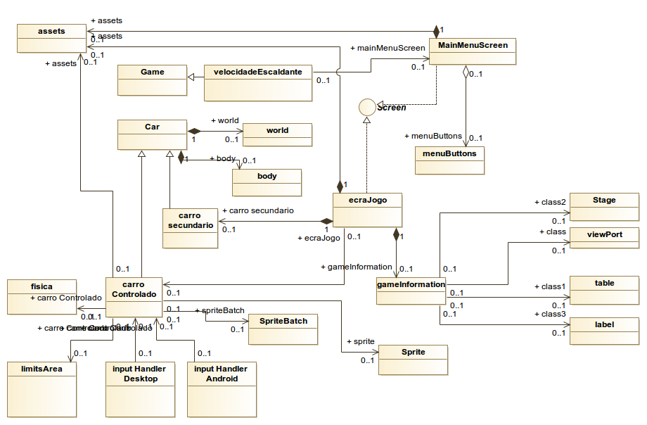
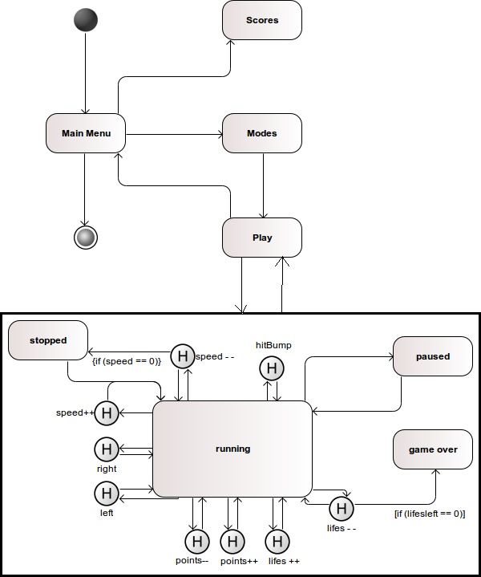
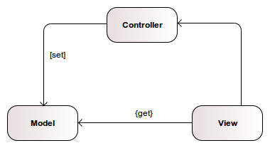
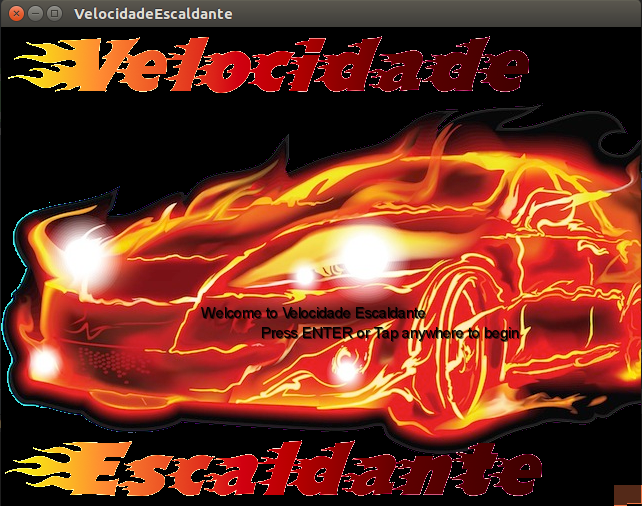
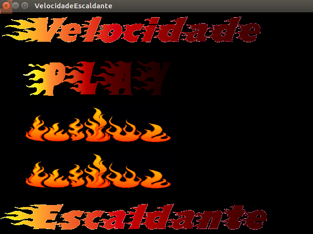
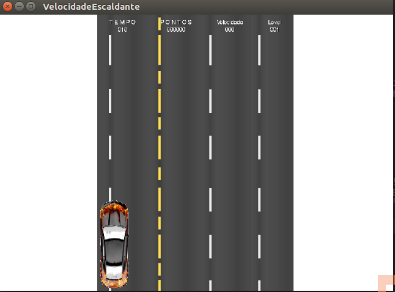

@finalRelease

Platform -specific executable files
-Java for multiple platforms
-Apk for Android

javadoc documentation files

Content in read.me

Setup installation procedure
-> how to install de developemeetn enviroment
-> how to install/run the game/app
Updated UML diagrams
Diagrama de classes
(rascunho feito)
Diagrama de Estados
(rascunho feito)
Diagrama de Sequências

Design Patterns usadas:

»Singleton: A classe VelocidadeEscaldante é a classe com uma única instanciação
»Flyweight: tendo em conta o uso de texturas no jogo, e sendo que muitas das  texturas são reusadas em diferentes locais, o Design Pattern FLyweight é implementado através da nossa classe Assets, que tem como resposabilidade o load das texturas usadas no jogo e o seu dispose().
»Update Method: Na maior parte dos objectos implementa-se o método update(delta) para simular um frame do comportamento do objecto. A ideia consiste no jogo fazer o update() em toda a rede de objectos.
»Component
Em continuação da ideia anterior do Update Method, o Design Pattern foi utilizado na class CarroControlado em que foi definida uma classe InputHandler, para controlo do CarroControlado quer para Desktop quer para Android, uma classe Fisica, para efectuar os cálculos comportamentais

Design decisions

Principais Dificuldades:

As principais dificuldades centram em 3 pontos essencias: pouco espaço temporal para compreensão da framework libgdx, uso e o processamento do tiled maps e dos seus objectos que nos levou a reconsiderar outros caminhos de implementação, e por último, a implementação de testes

Lições apreendidas:

overrall time spent developing 
work distribution

Distribuição igualitária entre os membros do grupo

User manual with screen shotts - how to play /use the game

Ao incializar o jogo é apresentado o ecrã de boas vindas.
Pressionar qualquer tecla para passar ao menu
Seleccionar com o mouse Play, Exit ou Scores
Utilizar as setas para controlar o carro

## Architecture Design

  #### Package and UML
    
  O projecto utilizará a framework libGDX com foco no desenvolvimento em AndroidSDK e em Desktop.Utilizirá o package Physics
  Utilizou-se o diagram UML proposto pelo Prof André Restivo, onde se pretende acrescentar as classes especificas do jogo.
  
  
 
  
  
  #### Design of behavioural aspects (Maquina de Estados)

  

  #### Expected Design Patterns 
Esperamos implentar o MVC com a seguinte estruturação:

 

## GUI Design

   ### Main functionalities
   
   Haverá um interface com o menu inicial onde se pode iniciar o jogo, ver scores, e escolher o modo de jogo.
   O controlo do carro é definido com as teclas, UP, DOWN, LEFT e RIGHT para o controlo de velocidade e de direcções     respectivamente. No Android este controlo é efectuado através do giroscópio que detectará as inclinações do dispositivo.
 
  ### GUI mock-ups
  
  Foi utilizado o sofware Tiled para gerar o mapa do jogo e os objectos estáticos dentro do mapa.
  
  ## User Manual
  
  Ao iniciar o jogo é visualizado o ecrã de boas-vidas
  
  
  Pressionar enter our clickar no rato, e será visualizado o Menu de opções
  
  
  
  Existem três opções: Play, Exit e Scores, se click no play iniciaremos o jogo e se no exit encerrá o jogo. Os scores mostraram as útlimas pontuações activas.
  Se a opção do user for o play, iniciará o jogo mostrando a seguinte imagem
  
  
  
  O user terá controlo do carro apresentado no canto inferior esquerdo. O controlo será feito exclusivamente com as setas UP, para aumentar a velocidade até a um limite máximo, o LEFT para o carro se deslocar para a esquerda, o RIGHT para o carro se deslocar para a direita, e o DOWN para travar e parar o carro completamente.
  O objectivo será completar o troço da estrada o mais rápido possível evitando colisões com outros carros que aparecerão na estrada. Caso haja colisão o jogo acabará em Game Over.
  
  ## Test Design
  
  ### Test cases
  1) [android] inclinação do ecrã para a direita, o carro vira para a direita
  2) [android] inclinação do ecrã para a esquerda, o carro vira para a esquerda
  3) Teste dos inputs das teclas para modificação da velocidade e direcção do carro
  4) Se colisao com outro veiculo tira pontos
  5) Se colisao entre player 1 e player 2 nao tira pontos mas tem efeitos fisicos
  6) Se frente/trás altera velocidade como deve
  7) Se atropelar diminui vidas.
  8) Se atingir caes ou gator diminui pontos
  9) Se bonus de vidas/pontos produz o efeito desejado
  10) Se colisao acusa
  11) Se escolha no menu altera para menu certo
  12) Se escolha do modo altera o modo
  13) Se lombas com velocidade em excesso diminui a mesma e se tira pontos e se faz vibrar no Android
  14) [multiplayer] Se multiplayer preenche ambas estruturas e cada um no certo
  15) Se sem pisca não vira mas vira com pisca e só para esse lado
  16) Se passadeiras, peoes e animais aleatorios na aparicao
  17) Se pisca faz mudar sprite para ver-se a piscar (no lado correcto)
  18) Se pontos maiores que guardados sao guardados e so esses
  19) [multiplayer] Se por um morrer o outro nao acaba
  20) Se velocidade nao desce abaixo de zero e se quando zero => parado e nao vira
  21) Se velocidade nao ultrapassa limite na macro
  22) Se veiculos alheios variam aleatoriamente
  23) Se vidas = 0 => gameover
  24) Se vira direita e esquerda mas sem ultrapassar bermas nem passar obstaculos
  25) Se vira só com pisca 
  26) Se muda estado para o estado correcto com eventos de mudança de estado
  27) Se inputs espoletam os eventos desejados
