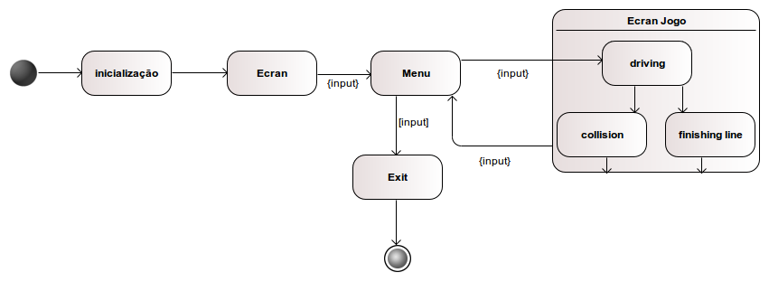

A segunda parte do projecto incide sobre um jogo onde o user controlará um carro numa estrada, onde evita colisões com outros
carros ou outros objectos numa estrada com 3 vias. Quanto mais rápido percorrer a via maior sem colisões maior é o seu score. 
O jogo será em 2D com top view.

## Architecture Design

  #### Package and UML
    
  O projecto utilizará a framework libGDX com foco no desenvolvimento em AndroidSDK e em Desktop.Utilizirá o package Physics
  Utilizou-se o diagram UML proposto pelo Prof André Restivo, onde se pretende acrescentar as classes especificas do jogo.
  
  
 
  
  
  #### Design of behavioural aspects (Maquina de Estados)

  

  #### Expected Design Patterns 
Esperamos implentar o MVC com a seguinte estruturação:

 

## GUI Design

   ### Main functionalities
   
   Haverá um interface com o menu inicial onde se pode iniciar o jogo, ver scores, e escolher o modo de jogo.
   O controlo do carro é definido com as teclas, UP, DOWN, LEFT e RIGHT para o controlo de velocidade e de direcções     respectivamente. No Android este controlo é efectuado através do giroscópio que detectará as inclinações do dispositivo.
 
  ### GUI mock-ups
  
  Foi utlizado o sofware Tiled para gerar o mapa do jogo e os objectos estáticos dentro do mapa.
  
  ## Test Design
  
  ### Test cases
  1) [android] inclinação do ecrã para a direita, o carro vira para a direita
  2) [android] inclinação do ecrã para a esquerda, o carro vira para a esquerda
  3) Teste dos inputs das teclas para modificação da velocidade e direcção do carro
  4) Se colisao com outro veiculo tira pontos
  5) Se colisao entre player 1 e player 2 nao tira pontos mas tem efeitos fisicos
  6) Se frente/trás altera velocidade como deve
  7) Se atropelar diminui vidas.
  8) Se atingir caes ou gator diminui pontos
  9) Se bonus de vidas/pontos produz o efeito desejado
  10) Se colisao acusa
  11) Se escolha no menu altera para menu certo
  12) Se escolha do modo altera o modo
  13) Se lombas com velocidade em excesso diminui a mesma e se tira pontos e se faz vibrar no Android
  14) [multiplayer] Se multiplayer preenche ambas estruturas e cada um no certo
  15) Se sem pisca não vira mas vira com pisca e só para esse lado
  16) Se passadeiras, peoes e animais aleatorios na aparicao
  17) Se pisca faz mudar sprite para ver-se a piscar (no lado correcto)
  18) Se pontos maiores que guardados sao guardados e so esses
  19) [multiplayer] Se por um morrer o outro nao acaba
  20) Se velocidade nao desce abaixo de zero e se quando zero => parado e nao vira
  21) Se velocidade nao ultrapassa limite na macro
  22) Se veiculos alheios variam aleatoriamente
  23) Se vidas = 0 => gameover
  24) Se vira direita e esquerda mas sem ultrapassar bermas nem passar obstaculos
  25) Se vira só com pisca 
  26) Se muda estado para o estado correcto com eventos de mudança de estado
  27) Se inputs espoletam os eventos desejados
