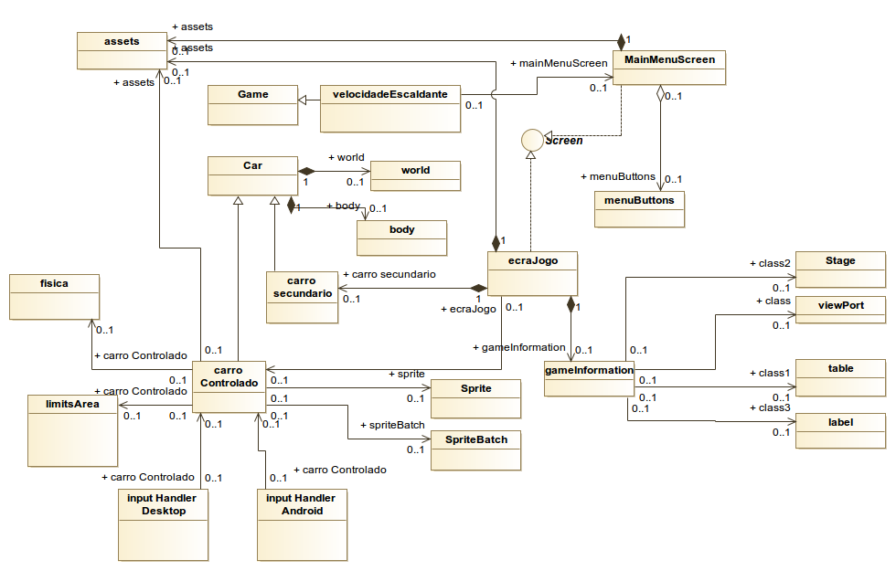

@finalRelease

Platform -specific executable files
-Java for multiple platforms
-Apk for Android

javadoc documentation files
## User Manual
  
  Ao iniciar o jogo é visualizado o ecrã de boas-vindas:
  
  
  
  Pressionar "enter" ou "clickar" no rato, e será visualizado o Menu de opções:
  
  
  
  Existem três opções: Play, Exit e Scores.No play iniciaremos o jogo, e no exit encerrá a aplicação. Os scores mostram as últimas pontuações activas.
  No caso de user seleccionar Play, iniciará o jogo mostrando a seguinte imagem:
  
  
  
  O user terá controlo do carro apresentado no canto inferior esquerdo. O controlo será feito exclusivamente com as setas UP, para aumentar a velocidade até a um limite máximo de velocidade, o LEFT para o carro se deslocar para a esquerda, o RIGHT para o carro se deslocar para a direita, e o DOWN para travar e parar o carro completamente.
  O objectivo será completar o troço da estrada o mais rápido possível evitando colisões com outros carros que aparecerão na estrada. Caso haja colisão o jogo acabará em Game Over. Em cada nível, a velocidade máxima aumentará tornando todo o jogo mais rápido.

## Development documentation

  ### Package and UML
    
  O projecto utilizará a framework libGDX com foco no desenvolvimento em AndroidSDK e em Desktop.Utilizirá o package Physics
  Utilizou-se o diagram UML proposto pelo Prof André Restivo, onde se pretende acrescentar as classes especificas do jogo.
  
  
 
  
  
  ### Design of behavioural aspects (Maquina de Estados)

  

 ###  Design Patterns usados
 
 #### Flyweight
 Tendo em conta o uso de texturas no jogo, e sendo que muitas das  texturas são reusadas em diferentes locais, o Design Pattern FLyweight é implementado através da nossa classe Assets, que tem como resposabilidade o load das texturas usadas no jogo e o seu dispose(). 
 Na implementação da classe Física para o comportamento dos objectos também recorremosao flyweight, pois a maior parte das variáveis, como por exemplo, fricção, restituição, densidade, velocidade máxima e forças são partilhadas por diversos objectos.
 
#### Update Method
Na maior parte dos objectos implementa-se o método update(delta) para simular um frame do comportamento de objectos independentes. A ideia consiste no jogo fazer o update() em toda a rede de objectos.

#### Component
Em continuação da ideia anterior do Update Method, o Design Pattern foi utilizado na class CarroControlado em que foi definida uma classe InputHandler, para controlo do CarroControlado quer para Desktop quer para Android.

### Design decisions 
  
  
  
  ### Junit Test Cases
  
  Apesar de termos recorrido  a diversos links fomos infrutíferos na implementação dos testes unitários.
  Na nossa tentativa, seguimos as recomendações deste reposítório:
  
  https://github.com/TomGrill/gdx-testing
  
  como também tentamos mudar as configurações sugeridas nestas webpages:
  
  http://manabreak.eu/java/2016/10/21/unittesting-libgdx.html
  
  https://staticdot.com/howto/junit-libgdx
 
### Work distribution

Numa fase inicial, do desenvolvimento da ideia e e da implementação das primeiras linhas de código, a distribuição de trabalho foi feita do modo pair programming. Na fase intermédia e final, ambos fomos decidindo e resolvendo os bugs de forma prioritária.
Portanto, consideramos a distribuição do trabalho igualitária entre os membros. 

### Major Difficulties

As principais dificuldades foca-se na adaptação à framework libgdx e aos testes unitários.
Numa primeira fase decidimos implementar um mapa TMX, com o intuito de desenvolver um mapa com diversos objectos internos, o que teóricamente, nos iria facilitar no processamento de colisões numa fase mais tardia. No entanto, revelou-se precisamente o contraŕio, com consequências ao nível do tempo dispendido. 
Num segunda fase, encontramos dificuldades na implementação dos testes unitários, que apesar de toda a literatura web lida não nos levou a nenhuma efectiva implementação dos testes unitários.
Na fase final, deparamo-nos com a diferença de leitura de ficheiros entre o uso do desktop e do android.

### Lessons Learned

Na fase final deste projecto, consideramos o nosso tema ser demasiado ambicioso tendo em conta que desconheciamos completamente a framework que iriamos utilizar. Chegámos a conclusão que provavelmente deveríamos ter escolhido um tema mais simples e mais usual para uma primeira implementação, em vez de optar pela originalidade. Definitivamente, a lição apreendida é a de que é essencial um bom dominio da ferramenta para chegar a um bom resultado.

### Overrall time spent developing 
Tendo em conta que só nas aulas práticas equivalem a 24 horas dispendidas para o desenvolvimento do jogo, fora deste período estimamos cerca de 10-11 horas por semana e por cada elemento do grupo, o que totaliza cerca de 180 horas dispendidas neste projecto.
